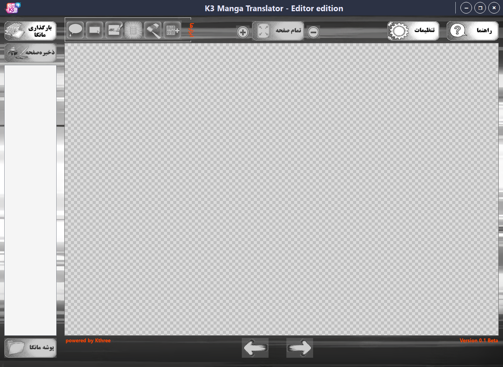

# 📖 ویرایشگر مترجم مانگای K3

  <strong>این نرم‌افزار توسط تیم Kthree، با عشق به دنیای مانگا و اشتیاق به فناوری، به‌صورت رایگان برای جامعه مترجمان فارسی‌زبان توسعه داده شده است.</strong>
  

---

### ✨ داستان ما: از یک نیاز تا یک راه‌حل

ایده ساخت این ویرایشگر از یک نیاز مشترک و یک دغدغه قدیمی زاده شد. هر مترجم مانگا، داستان کلنجار رفتن با نرم‌افزارهای مختلف را به خوبی می‌شناسد: یک برنامه برای پاکسازی، دیگری برای استخراج متن و سومی برای حروف‌چینی؛ که هیچ‌کدام هم به درستی از زبان فارسی و چالش‌های بومی‌سازی آن پشتیبانی نمی‌کردند. سال‌ها بود که جای خالی یک ابزار قدرتمند، یکپارچه و فارسی برای ترجمه مانگا به شدت احساس می‌شد.

ما باور داریم که مترجمان و ویراستاران، هنرمندانی هستند که داستان‌ها را برای ما زنده می‌کنند. اما ابزارهای نامناسب می‌توانند خلاقیت را محدود کنند. با حسرت می‌دیدیم که ابزارهای خارجی، با تمام امکاناتشان، در درک ظرافت‌های زبان فارسی ناتوان‌اند و فرآیندهای موجود، به دلیل این پراکندگی، ناکارآمد و زمان‌بر هستند.

 

### 🚀 چشم‌انداز ما

هدف ما فراتر از ساخت یک ابزار ساده بود؛ ما به دنبال ایجاد یک برنامه یکپارچه در صنعت ترجمه مانگا در ایران بودیم. می‌خواستیم ابزاری بسازیم که مترجم بتواند تمام تمرکز خود را روی کیفیت ترجمه و ویرایش بگذارد، نه درگیری با محدودیت‌های فنی. ویرایشگر مترجم مانگای K3 با این چشم‌انداز توسعه یافت که با قدرت هوش مصنوعی و پردازش تصویر مدرن، تمام مراحل را در یک محیط واحد و بهینه گرد هم آورد و یک برنامه یکپارچه به دست مترجمان مانگا بدهد.

این برنامه، پاسخ ما به تمام این نیازها و هدیه‌ای از طرف ما به جامعه پرشور مانگای ایران است. امیدواریم این ابزار به شما قدرت دهد تا آثاری ماندگار و بی‌نقص خلق کنید و به آن افتخار کنید.

امیدواریم این برنامه در خلق آثاری با کیفیت و زیبا به شما کمک کند.

---

### 📥 **نحوه دریافت و راهنمای استفاده**

برای شروع کار با ویرایشگر K3، لطفاً مراحل زیر را دنبال کنید:

#### **۱. دریافت نرم‌افزار**

فایل‌های برنامه جهت دسترسی آسان، بر روی سرور MEGA بارگذاری شده است. برای ورود به صفحه دانلود، روی دکمه زیر کلیک کنید.

  

> **راهنمای دریافت فایل:**
> پس از ورود به لینک، روی گزینه‌ی **"Download"** کلیک نمایید. سپس، از منوی باز شده گزینه‌ی **"Download as a ZIP"** را انتخاب کنید تا تمامی فایل‌ها به صورت یکپارچه و فشرده دریافت شوند.

 

#### **۲. راهنمای ویدیویی**

به منظور آشنایی کامل و سریع با تمام قابلیت‌های نرم‌افزار، یک ویدیوی آموزشی جامع تهیه شده است. برای مشاهده، لطفاً بر روی تصویر زیر کلیک نمایید:

<strong><a href="https://www.youtube.com/watch?v=_jB2Qn4O66Y" target="_blank">مشاهده مستقیم در وب‌سایت یوتیوب</a></strong>

---

### 💬 ارتباط با ما

از اینکه از ویرایشگر مترجم مانگای K3 استفاده می‌کنید سپاسگزاریم!

برای ارتباط با ما، ارائه پیشنهادات یا گزارش مشکلات، می‌توانید از راه‌های زیر استفاده کنید:
*   **ایمیل:** <a href="mailto:Khalilkhko@gmail.com">Khalilkhko@gmail.com</a>
