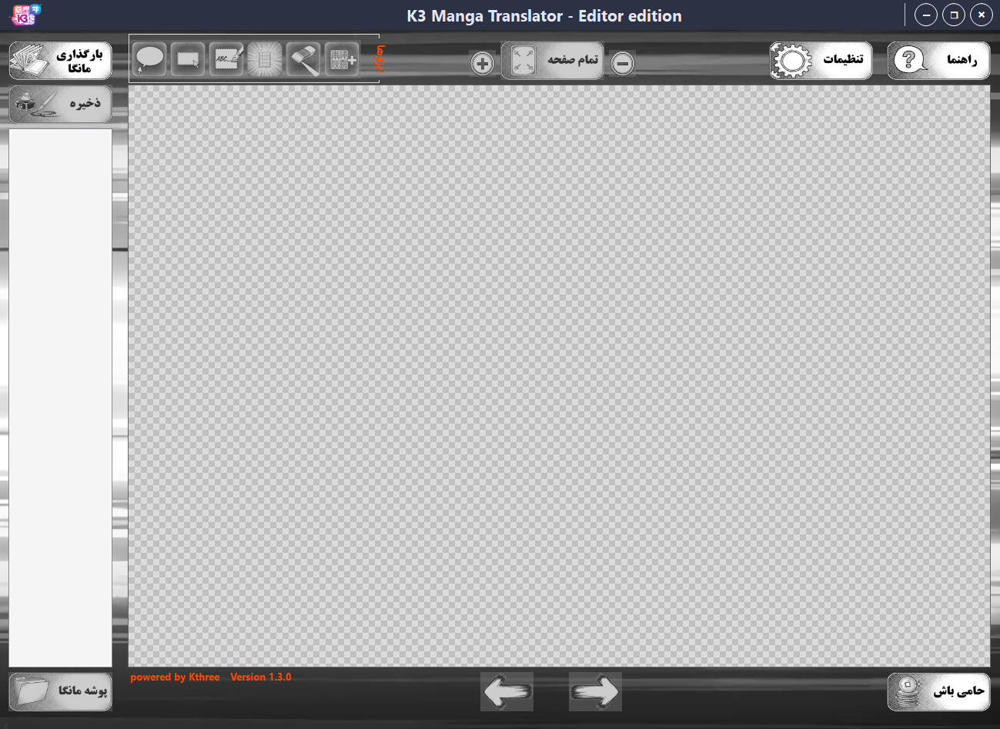

<!-- START OF README.md -->

  <!-- LOGO -->
  

  <!-- TITLE -->
  <h1>K3 Manga Translator - Editor edition</h1>
 
  <!-- SUBTITLE -->
  <h3>
    پایان پراکندگی، آغاز هنر ترجمه. 
    یک استودیوی کامل برای مترجمان مانگا.
  </h3>

   

  <!-- LINK BUTTON (Corrected Structure) -->
  <!-- 👇 لینک سایت خودت رو جایگزین YOUR_WEBSITE_URL_HERE کن 👇 -->
  <h2>
    <a href="https://kthree-k3.github.io/K3-Manga-Translator-Editor-edition">
      🔗 برای ورود به صفحه دانلود و معرفی برنامه کلیک کنید
    </a>
  </h2>

 

## 📖 داستان تولد K3 Manga Translator

ایده‌ی ساخت این برنامه از یک مشاهده‌ی دقیق و درکِ یک نیاز واقعی متولد شد. ما دیدیم که مترجم‌های مانگا چقدر با ابزارهای پراکنده درگیر هستند؛ یک برنامه برای پاکسازی، یکی برای استخراج متن و سومی برای تایپ! و بدتر از همه، هیچ‌کدوم از این ابزارهای خارجی، دغدغه‌های زبان فارسی و راست‌چین رو درک نمی‌کردن.

تیم **K3** تصمیم گرفت به این پراکندگی پایان بده. ما این ابزار رو توسعه دادیم تا "فناوری" رو در خدمت "هنر" قرار بدیم. هدف این بود که یک محیط یکپارچه و تخصصی بسازیم تا مترجم، بدون درگیری با مشکلات فنی، فقط روی کیفیت ترجمه تمرکز کنه.

> **برای کمک به جامعه‌ی مترجمان فارسی‌زبان، این برنامه با تمام قابلیت‌های حرفه‌ای‌اش به صورت کاملاً رایگان منتشر شده است.**

 

## 📸 نمای محیط برنامه

  

 

  Developed with ❤️ by Kthree Team

